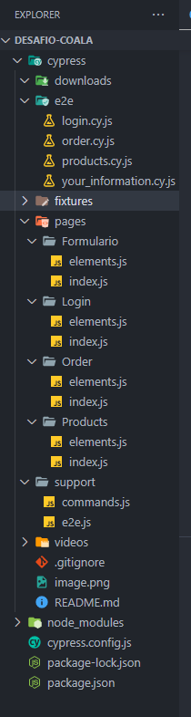

# Desafio Coala Saúde
![logocoala](data:image/png;base64,iVBORw0KGgoAAAANSUhEUgAAAOEAAADhCAMAAAAJbSJIAAAAt1BMVEX+9JJwR7//+ZFoO8D/+JLAqqdwR77/9ZHFsqP/+5BwR8H+9JX/+o///JD+9Y9uRMBsQcBpPb9jMsD/+pVmOMCBYLT88pdkNb2pj6xwSLvJt6b985bPv6SMbLTz6Jfx5pmbg7B2UbV6VrSOcbTXyZuvm6rAsKbu4p3p3KCTd7BkMcKslquXd7XXyKTe1J3m2pyii621oqiKabqdf7J/WbTZyaCojq9zTLh+V73LuqG+qKyZgKxpO7hxIayUAAAF0UlEQVR4nO3ceXeqOBgHYCGY3IQlgAh1Kd6qlW52Gds63un3/1yDbeecKmClcJCc+T2Hv3Py5s1GWDodAAAAAAAAAAAAAAAAAAAAAAAAAAAAAAAAAAAAgJo5Ot+yjJrLNSybc5vrTs3llsXsya/f/Yvp7GxuWqyuUh3T6s0vZ9OL/mqR2HrHrKvg8uyr6xviulK6XjDohnXlkVldGpG0VM0l/uzerq3pyjL5pe9qlGpaemmSTK+sOop1esk0kJoQ78Vqrn/bc07TV5lxF7zX4T8yWuo1lKvPA/druTSYmafJYm8VaOJrhJqI7q2qY8bRH4igu8V6dz12gizybrRbkW0WaVy1tVm4dvfLFcGTXUudS3EmZC+DW95j1arwW4/ul0tFlDTfT/mZm4kvbW1/Uq0qLPSz7Za23IrXVO9jOSyUmT66RZ4qzaeO0SV55Yq3sOkkphNeXltrsl+tm/K/cvp+2k/JuO5N03esJy83Qi0aVWrs3ltusZRc1rdlOg5/zBuGKT+pMq87sZ9bKnUbH4j8d36Ewn+oFGGSH6FwZ02vF0U5pFG1CCdRftdwr+1m13zTuvTyq3JTadJzzKIIz2rZ85agL4P87nTRq1Su3c/saN6LbX4u7cT5cym5rdbW1hPJbbho0vjG1M6favykWlunAzGv5dJhWFO9j8eu8qqSTnkV25qv3MyaLzT/vvFO2mH8NtufhJdUvc1xYi8zEmnwyE9wh8jM/l6IlPqb6jsPfXkjd+4uBsJ9Ps0tsBM+74Y4uFkc3ngwxpwUO1xde+Pv3AIL7yKu4+zgB4zRypefrS2odN/GhdOB02E652Y8SZJkEptcNw50ZvtFfllspX83an4QfmL6cup7UgghJQkei1va0Xm8OesPSLRFBv3XTazrhanU41dC3LTxhPT8i/Hpztq2Ifbmr8/UddezRVI4izIr3JwTsm0KbXuEJjTpBtH5cJQO2vzKOzxezNbS1f4+Wxr6CY9LtwzLHoWhYVtF8TnWqDsIsoun69OnsLD2zLKNMB7Z/EQjcEc6c7DiNcKxxwMiMkcv26lXBnR4aPk8VGx7GOG1L7PR/TdN+te1HZSfiP6wLjgL+MyjO7jiJx5nlVhzP69/fs2iiF6avnuvkfVy802A6TZB3ixPsSWrRbo5z73Z2++p/rwNE2Z5phPK3Dk021FJrMKkmcH4ecFxXFbfUHG24d2oeJnYc5InL1U58dvRAWoiaP6QojL79eBCuKf5A9/KnJiUCFCjUcVnVs3Ti85Ti5L4qloSjXWZFKYjcaDYbGq8RINSEWrRi1LLvpN20nI51LzGj+2rsftHr/af5HO1xwENY6EsmUJNeKFKS6Je8BjwABrdqzQQjXn+k6lDglpeqGqKvsl9gnQQGR46Q20bNiyfQ9JVKYfG8Ac5VCvCX4gQEbYdIkSE7YcIEWH7IUJE2H6IEBG2HyJEhO2HCBFh+yFCRNh+iBARth8iRITthwj/txEq9JTb+Mlz/IVKrwzp4x88x98YCr2eaNz/4G0Tpd5nL/ysvhj1FXtNeH38K9Af5KDaDzWaZt+5JV9sc8/Vepndzv/NzAFetR/bNI4l2Z9IHeZfKdVJOx3eLzcQ5bNqX+n1Sr7ZFnQr/wetYWyU+zekAkJ7C7/5hr19rD/5P5LKRy5VWu4/MFZiSRS04KPuVrNefHHkfEr9sXopTNmPx34Y5P1jd9Tasn0wzal7TBapvAiV/MIyvcOI6TEfJUiZKNlHt3rJm6TfZFGK6EG1pfAL/UH7ZgcuhLxSbTezw4innjgQo/DWE2W76Aejszrw+Yz0V6HiAW7/h71cE5nz1TqlMlif9N8zdWFW2NWC7P5GBvJppHwCPzBrtOhHxH3//w5Nt9lUuF70vDBtdefQfczgyZ9rGvgBCbYXnf154MV/UVKRYzo6N+L5cvhrOJ4nzNaVu1k6imMYuq4bKn2jBgAAAAAAAAAAAAAAAAAAAAAAAAAAANC0fwGsoGCK0DBuGAAAAABJRU5ErkJggg==)

Desafio de automação do *fluxo de compra* na plataforma https://www.saucedemo.com/.

## Indíce
- <a href="#tecnologias- utilizadas"> Tecnologias Utilizadas</a>
- <a href="#tecnologias- utilizadas"> Detalhamento de Organização</a>
- <a href="#tecnologias- utilizadas"> Funcionalidades do Projeto</a>
- <a href="#tecnologias- utilizadas"> Como rodar este projeto?</a>

## Tecnologias Utilizadas
1. [Cypress](https://docs.cypress.io/api/cypress-api/custom-commands)
2. Cypress / PageObject
3. JavaScript

## Detalhamento de Organização
A ideia do PageObject é de separar elementos em arquivos diferentes, de acordo a página em que os mesmos aparecem. Assim, escrevendo todos os elementos daquela página em uma classe js, e aplicando-os nos scripts de teste.

1.  **e2e**: spec;
2.  **Page** :  *Subpastas: Formulario, Login, Order, Products* identifica cada página;
3. ***elements.js***: descreve os elementos mapeados de cada página, como variáveis e elementos css;
4. ***index.js***: são as ações de cada página;
5. ***support/commands***: comandos padrões que são repetidos diversas vezes, nele encontra-se, por exemplo o acesos a página e o login.




## Funcionalidade do Projeto
- [x] Login : *(login.cy.js)*
- [x] Página do Produto : *(products.cy.js)*
- [x] Formulario de Informações : *(your_information.cy.js)*
- [x] Realização do Pedido : *(order.cy.js)*


## Como rodar este Projeto

```
- Baixe a pasta desafio-coala do github;
- Abra o VSCode em File > Open Folder;
- Localize a pasta que foi salva o projeto baixado;
- Abra o termibnal no VSCode em Terminal > New Terminal;
- Rodar o comando: npm install -D cypress 
para instalar o node_modules
- Para rodar o teste via linha de comando no terminal use: npx cypress run;
- Para rodar o teste via front (com abertura do navegador) use: npx cypress open.
```
***
### Informações Autorais:
Gleice Kelle Santos Nascimento Botelho
#####
***linkedIn***: https://www.linkedin.com/in/santosgleicekelle/
####
***email***: santosgleicekelle@gmail.com